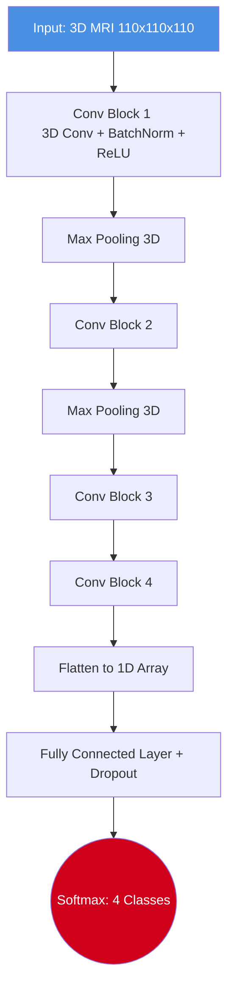
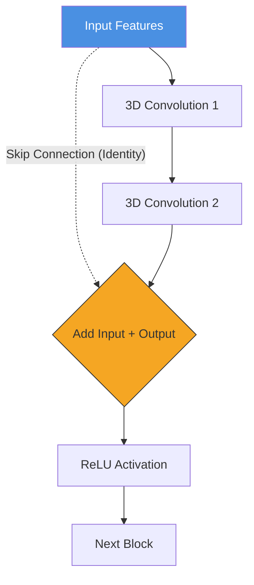
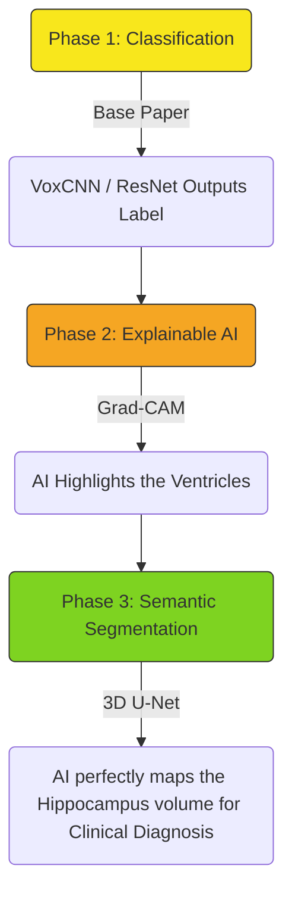

# 🧠 Detailed Project & Research Paper Guide (Mentor Q&A Prep)
*(Study this thoroughly! This contains the technical depth your mentor expects to hear.)*

---

## 1. The Core Problem (Why this paper matters)

### Traditional Machine Learning (The Old Way)
Before this paper, diagnosing Alzheimer's from an MRI using Machine Learning (like Support Vector Machines - SVM) required a **complex, multi-stage pipeline**:
1. **Preprocessing:** Skull stripping, alignment, and normalization.
2. **Handcrafted Feature Extraction:** Human engineers had to mathematically define what the AI should look for (e.g., manually calculating the volume of Gray Matter, White Matter, or Cerebrospinal Fluid).
3. **Feature Selection:** Choosing the best features so the AI doesn't get confused.
4. **Classification:** Feeding the features into an SVM.

**The Flaw:** This is incredibly time-consuming and relies entirely on human assumptions. If a human engineer forgets to tell the AI to look at a specific tiny region of the brain, the AI will miss the diagnosis completely.

### The Deep Learning Solution (The Paper's Way)
This paper proposes an **End-to-End 3D Convolutional Neural Network (CNN)**. 
Instead of humans extracting features, the raw 3D MRI volume ($110 \times 110 \times 110$ voxels) is fed directly into the network. The 3D convolutions automatically slide across the brain volume and **learn their own features** (like discovering shrinkage patterns on their own) to classify the patient.

---

## 2. The Dataset (ADNI)
If the mentor asks about the data, give them these exact stats:
*   **Source:** Alzheimer's Disease Neuroimaging Initiative (ADNI).
*   **Data Type:** Preprocessed 3D structural MRI brain scans.
*   **Dimensions:** $110 \times 110 \times 110$ voxels.
*   **Total Patients (231):**
    *   **AD (Alzheimer's Disease):** 50
    *   **LMCI (Late Mild Cognitive Impairment):** 43
    *   **EMCI (Early Mild Cognitive Impairment):** 77
    *   **NC (Normal Control / Healthy):** 61

---

## 3. The Two Architectures Evaluated

The paper compares two distinct deep learning architectures. You must understand the difference between them.

### A. VoxCNN (The Plain 3D CNN)
*   **Inspiration:** Based on the famous VGG network used for 2D images, but converted to 3D.
*   **Structure:** Contains 4 volumetric convolutional blocks. Each block extracts increasingly complex 3D patterns from the brain.
*   **Layers used:** 3D Convolutions, Batch Normalization (to stabilize training), Dropout (to prevent overfitting), and a Softmax classifier at the very end.
*   **Training Specs:** Adam Optimizer, Learning Rate: $27 \times 10^{-6}$, Batch Size: 5, Epochs: 150.

### B. ResNet (The 3D Residual Network)
*   **Inspiration:** Based on VoxResNet. Deep networks usually suffer from the "Vanishing Gradient Problem" (they forget what they learned early on). ResNet fixes this.
*   **Structure:** Extremely deep. It has **21 layers** with **6 Residual Blocks**. 
*   **The Secret Weapon (Skip Connections):** It uses "Identity Skip Connections." This means the input of a block is added directly to its output, bypassing the convolution. This allows gradients to flow perfectly through all 21 layers without dying out.
*   **Training Specs:** Nesterov Momentum Optimizer, Learning Rate: $10^{-4}$, Batch Size: 3, Epochs: 70.

---

## 4. Evaluation & Experimental Results
*   **Validation Method:** The researchers used **5-Fold Cross Validation**. This means they split the 231 patients into 5 groups. They train on 4 groups and test on 1, then rotate. This ensures the model isn't memorizing specific patients.
*   **Metrics Used:** They evaluated using **Accuracy** and **ROC-AUC** (Area Under the Receiver Operating Characteristic Curve—a metric that shows how well the model separates the classes).
*   **Key Results (AUC):**
    *   **AD vs NC:** VoxCNN ($0.88$) vs ResNet ($0.87$) -> *Both performed exceptionally well at telling sick from healthy!*
    *   **AD vs EMCI:** VoxCNN ($0.66$) vs ResNet ($0.67$) -> *Much harder, since early impairment looks similar to full AD.*

**The Conclusion:** Both end-to-end models successfully classified the disease and eliminated the need for human feature extraction.

---

## 5. What We Are Going to Do Further (Our Project Implementation)

*(This is where you bridge the paper to YOUR actual project to impress the mentor)*

> [!IMPORTANT]
> **The Mentor's Trap:** The mentor will likely ask, *"If the paper just outputs a label, how can a doctor trust it? It's a black box!"*

**Your Answer (Our Roadmap):**
1. **Implement the Baseline:** We will first implement the 3D CNNs to classify the MRI scans just like the paper.
2. **Break the Black Box (Explainable AI - XAI):** A simple classification label is not enough for medical professionals. We will implement **Grad-CAM (Gradient-weighted Class Activation Mapping)** to generate 3D Heatmaps. This forces the AI to visually highlight the regions of the brain (like the ventricles) that caused it to predict Alzheimer's.
3. **The Ultimate Goal (Semantic Segmentation):** We will take it one step further. Since Alzheimer's starts by destroying the **Hippocampus**, we will build a **3D U-Net Model**. Instead of just classifying, our U-Net will draw a precise 3D physical boundary around the patient's hippocampus and calculate its exact volume. 

By comparing the Hippocampal Volume against the patient's head size (eTIV), we will deliver an Explainable, Mathematically-backed Alzheimer's diagnosis that doctors can see with their own eyes!

