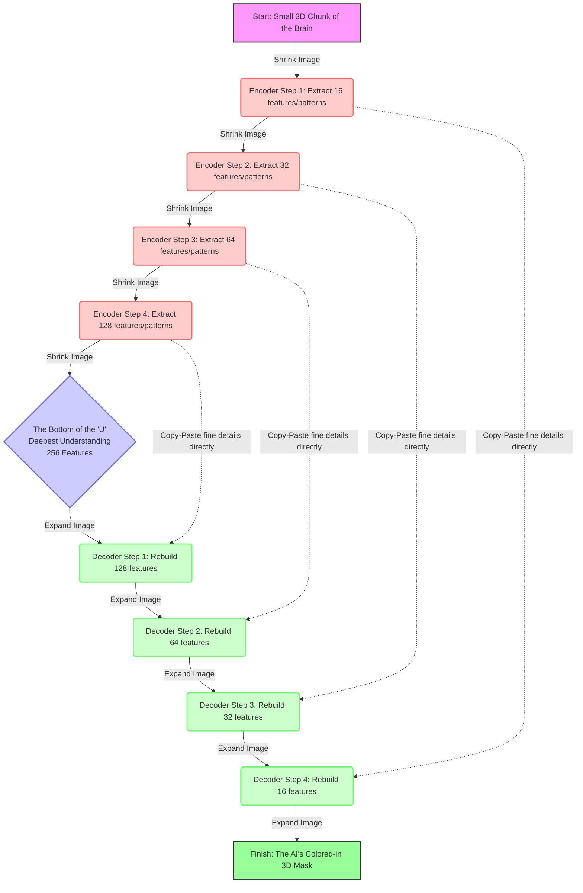

# Model 5: 3D Semantic Segmentation of the Hippocampus (Explained Very Simply)

If you are new to AI or medical imaging, this document explains **exactly** what we did for Model 5, step-by-step, in plain English. 

---

## 1. The Big Idea: What are we actually trying to do?

**The Goal:** We want to build an AI that can help detect Alzheimer's Disease extremely early.

**Why the Hippocampus?**
The brain is huge, but Alzheimer's disease always attacks one specific tiny part of the brain first: **The Hippocampus** (the part that controls memory). Long before a person's whole brain shrinks, their Hippocampus starts dying and shrinking. If we can measure the exact size of it, we can catch the disease early!

**What did our old models do?**
In our older models (Models 1 through 4), we just showed the computer pictures of whole brains and asked, *"Hey, does this look sick or healthy?"* (This is called Classification). But that isn't how real doctors work. It's too vague. 

**What does Model 5 do?**
Model 5 does what a real doctor does. We give the AI a 3D scan of a brain. We teach the AI to perfectly "color in" the Hippocampus. Once the AI colors it in, the computer simply counts how many "pixels" the AI colored. This gives us the exact size (the volume) of the Hippocampus. If the size is smaller than a healthy person's, the doctor knows the patient has Alzheimer's!
*Teaching an AI to precisely color in a shape is called **Semantic Segmentation**.*

---

## 2. The Data: What did we feed the computer?

**We needed 3D data, not 2D photos.**
A standard photo is 2D (flat). You cannot measure how big an apple truly is from a flat photo. The brain is the same way. We had to throw away our old dataset and get real 3D MRI scans. Instead of flat "pixels", 3D pictures are made of tiny 3D cubes called "voxels" (think of Minecraft blocks).

**The Dataset (Medical Segmentation Decathlon):**
We used a famous medical dataset. It contains:
1. **394 real 3D MRI brain scans** of different people.
2. **The Answer Key (Ground Truth):** Real human doctors went through all 394 scans and carefully colored in the Hippocampus by hand. We use these doctor-colored versions as an "Answer Key" to teach the AI what the right answer looks like.

**How we got it:**
We wrote code that automatically downloads this huge dataset straight from the internet into our workspace. We split it up: 80% of the brains are used as "flashcards" for the AI to practice on (Training), and 20% are hidden away to test the AI later (Validation).

---

## 3. Preparing the Data for the AI (The "MONAI" Steps)

3D brain scans are **MASSIVE** files. If we try to shove a whole 3D brain scan into the computer's graphics card (GPU) so the AI can look at it, the computer will instantly crash because it runs out of memory. 

To fix this, we used a special medical toolkit called **MONAI** to chop up and clean the pictures *before* the AI sees them. Here is exactly what our code does, step-by-step:

1. **`LoadImaged`:** Opens the 3D brain scan file.
2. **`CropForegroundd`:** A brain scan usually has a lot of empty black space around the head. This step acts like scissors and chops off all the useless black space so we only focus on the brain itself. This saves a ton of memory!
3. **`ScaleIntensityRangePercentilesd`:** Every MRI machine in a hospital takes slightly different pictures (some are brighter, some are darker). This step acts like a photo filter; it makes sure the brightness is exactly the same for all pictures, so the AI doesn't get confused.
4. **`RandCropByPosNegLabeld` (The Most Important Step!):** Even after chopping off the black space, the whole brain is *still* too big for the computer's memory. So, this step cuts out a tiny 3D block (called a "patch" or a chunk) from the brain. The chunk is only 32x32x32 blocks big. We feed these small chunks to the AI instead of the whole brain. This completely stops the computer from crashing!
5. **`ToTensord`:** This just translates the picture into numbers (Tensors) because AI only understands math, not colors.

---

## 4. The Brain of the AI: The Detailed 3D U-Net Architecture

The AI brain we built is called a **3D U-Net**. It is literally shaped like the letter "U". 
Why? Because to color in a shape, the AI needs to do two things:
1. **Shrink the image (The left side of the U):** It steps back to look at the "big picture" to understand *what* it is looking at (Is this a brain? Is this bone?).
2. **Expand the image (The right side of the U):** It zooms back in to figure out *exactly where* the edges of the Hippocampus are.

Here is a diagram showing exactly how the data flows through our AI's "Brain":

**What are those "Copy-Paste" arrows? (Skip Connections):**
When the AI shrinks the image down to understand the "big picture", it forgets where the sharp edges of the Hippocampus were. The dotted arrows are a "cheat code". They copy the sharp edges from the shrinking side and paste them directly to the expanding side. This allows the AI to color perfectly inside the lines!

**The Final Output Classes:**
At the very end, the AI spits out an image where every voxel (3D block) is labeled as one of 3 things:
1. **Class 0:** The Background (Nothing).
2. **Class 1:** The Head of the Hippocampus.
3. **Class 2:** The Body of the Hippocampus.

---

## 5. How the AI Learns (Detailed Training Steps)

We don't just build the brain; we have to send it to school. We put the AI in a loop where it practices coloring over and over again. Here is exactly how that training works:

### Step A: The Grader (The "Dice Loss" Function)
This is how the AI knows if it made a mistake. 
Imagine the AI colors in its guess, and we put the Human Doctor's perfect Answer Key right on top of it. If the AI colored outside the lines, the "Dice Loss Grader" yells at the AI. The AI wants to get a perfect score, so it tries to color better next time to make the Dice Loss number go down to zero. *(We used Dice Loss because it specifically measures how well two 3D shapes overlap).*

### Step B: The Optimizer (`AdamW`)
When the Grader yells at the AI, the AI doesn't know *how* to fix itself. The Optimizer acts like the AI's mechanic. It reaches into the AI's brain and turns tiny math knobs (called weights) slightly to the left or right, so the AI is slightly smarter for its next guess.

### Step C: Practice Rounds (Epochs)
An "epoch" is one full practice round where the AI looks at **all** the training brains. We let it practice many times (epochs) so it gets better and better. Because of our GPU memory limits, we only let the AI look at 2 brains at a time (Batch Size = 2). 

### Step D: The Pop Quiz (Validation via `sliding_window_inference`)
Every few practice rounds, we stop training and give the AI a "Pop Quiz". We show it the 20% of brains we hid away earlier. Since the AI has never seen these brains, this proves it is actually learning how to find the Hippocampus, rather than just memorizing the practice flashcards!
*   **The Problem:** The pop quiz brains are full-sized, which means they are too big for the GPU.
*   **The Solution (`sliding_window_inference`):** Our code takes a small "magnifying glass" window (32x32x32 blocks big) and slides it across the giant brain. It takes a guess, moves the magnifying glass, takes a guess, and stitches all the small guesses together at the end to form one giant answer!

---

## 6. The Final Output: What do we actually get?

After all this training, our code produces the final clinical tools a doctor would use:

1.  **Learning Graphs:** We get charts that show the AI's mistakes going down over time. This proves our code worked!
2.  **Visual Proof (The Pictures):** The code prints out an image with three panels side-by-side:
    *   **Panel 1:** The raw, blank brain scan.
    *   **Panel 2:** The human doctor's perfect colored-in answer key.
    *   **Panel 3:** The AI's attempt. If we trained it well, the AI's coloring looks almost exactly like the human doctor's!
3.  **The Diagnosis Number (The most important part!):** Finally, the code looks at the AI's colored-in 3D shape and counts exactly how many tiny blocks (voxels) it colored. It spits out a final number, like `Hippocampus Volume: 3500 mm³`. 
    
**A real doctor takes this number, sees that it is shrinking compared to a healthy brain, and can officially diagnose the patient with early-stage Alzheimer's Disease.**
